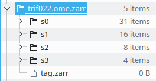

# About
GUI Dialog to show structure of an ome.zarr dataset and to allow the user to
cherry-pick image of interest, in Fiji.

The (now future) dialog is opened in two ways.

## The hard-coded way
Start [the main() in the DialogAroundZarr class](https://github.com/xulman/ome-zarr-fiji-ui/blob/d479aaa9cff2ecff637f7f5184b19ed581e6983a/src/main/java/sc/fiji/ome/zarr/fiji/ui/DialogAroundZarr.java#L25)
on your own OME.Zarr (hard-coded) folder.

## The drag-and-drop way
Compile and copy this project's .jar into any Fiji.app installation, and drop
`anyName_eg_tag.zarr` file onto a Fiji window. That "tag" file has to reside
directly inside your `.ome.zarr` folder, and must end with suffix `.zarr`
-- see example below.

Currently, this is the only way Vlado knows about to trigger the drag-and-drop
mechanism such that it can give control to our code here on the drop event.
