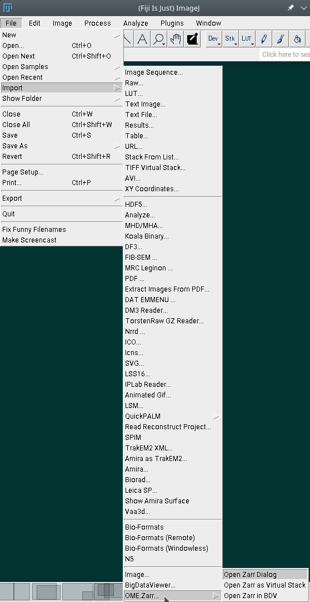
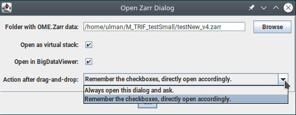
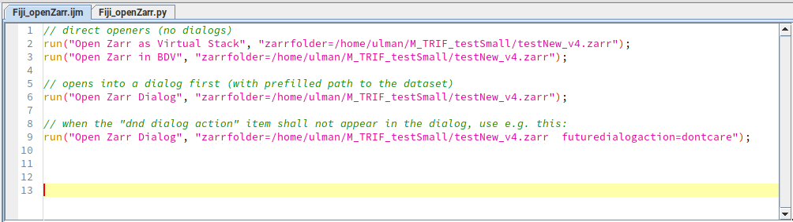
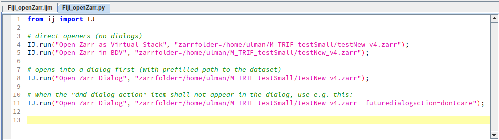

**This repository is now obsolete in favor of its [successor at GH/BioImageTools/ome-zarr-fiji-java](https://github.com/BioImageTools/ome-zarr-fiji-java/).**

---------------

# About
Here's the home of the Fiji wrapping plugins that bring
[OME.Zarr (at specs 0.4)](https://ngff.openmicroscopy.org/0.4/)
to [Fiji](https://fiji.sc/), currently only for the reading.

Several ways of importing a zarr container are supported:

### Using Fiji menus
Try: Fiji -> File -> Import -> OME.Zarr... -> Open Zarr* menu items

### By dragging and dropping...
[...the top-level zarr folder onto the Fiji main window](https://www.fi.muni.cz/~xulman/files/OME.Zarr_dragAndDrop_forFiji-2022-09-14_14.26.31.webm)
(video, 49 secs). Both options can lead to opening of a dialog

that
- offers options of showing the zarr content,
- **controls the effect of the drag-and-drop event.**

One can use this dialog to (repetitively) adjust the behavior of the drag-and-drop
-- just don't forget to press 'OK' button in that dialog (it's not enough to adjust
the toggles and close it, it won't be remembered).

### Programmatically...
...from the ImageJ macros,

and from Jython scripts.

Example code can be downloaded from [the `examples` folder](doc/examples).

# Installation
Three pieces of software are (at least) needed:
- modified `ij-1.xxy.jar` according to [the fix by Ko Sugawara](https://github.com/ksugar/ImageJ/tree/dnd-zarr)
- extended `mobie-io-1.2.13.jar` from [Christian Tischer's github](https://github.com/mobie/mobie-io/tree/hackathon_prague_2022)
- the `ome-zarr-fiji-ui-0.1.0.jar` from this repository (master branch).

You can also get them from [the `jars` folder](doc/jars) and drop them into your Fiji installation,
into its `jars` folder from which it's original `ij-1.xxy.jar` should be removed first.

# Authors
This is a result of collective work of several people noted below, during the
**Fiji and Zarr hackathon 2022 in Prague, CZE**, which was generously supported by the
[IT4Innovations National Supercomputing Centre, Ostrava, CZE](https://www.it4i.cz/en):

- [forum.sc link](https://forum.image.sc/t/fiji-ngff-hackathon-sep-2022-prague-cze/69191),
- [zulip link](https://imagesc.zulipchat.com/#narrow/stream/329366-Zzz.3A-.5B2022-09.5D-Fiji.2BNGFF-Prague-hackathon),
- [link at IT4I](https://events.it4i.cz/event/145/).

The people on-site during the hackathon: 
**Ko Sugawara, Nils Norlin, Tobias Pietzsch, Christian Tischer, Vladimir Ulman**

The people online during the hackathon: 
**Gabor Kovacs, Isaac Virshup, Luca Marconato, John Bogovic, Josh Moore**

I want to **thank all of them** for devoting their time so far to this project.
